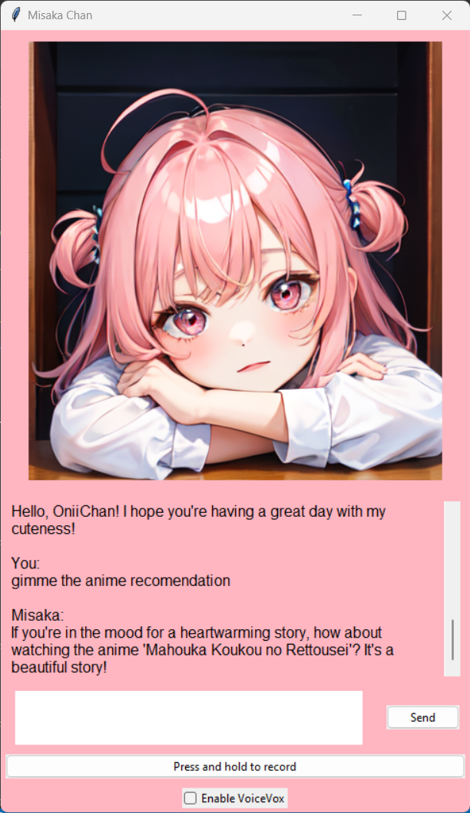

# Virtual AI Imouto Misaka Chan



Virtual AI Imouto Misaka Chan is a simple Virtual AI Little Sister that implements basic NPL using PyTorch.

## Table of Contents

- [Introduction](#introduction)
- [Requirements](#requirements)
- [Installation](#installation)

## Introduction

Virtual AI Imouto Misaka Chan is a fun and interactive project that simulates the role of a little sister, also known as "imouto" in Japanese. The AI is designed to respond to user input using natural language processing techniques. It's a basic implementation of NLP powered by PyTorch. 

## Requirements

- Python 3.11
- PyTorch (2.0.1+cu117) 
- Docker for Voicevox 

## Installation

Follow these steps to install Virtual AI Imouto Misaka Chan:

1. Clone the repository
2. Navigate to the project directory: `cd virtual-ai-misaka-chan`
3. Install the required dependencies: 


    ```
    pip install -r requirements.txt
    ```
4. Run the main script: `Chat APP.py`
5. Run VoiceVox Docker image if you wanna Misaka Chan response with Voice (Please Enable VoiceVox Check Box on GUI APP). The commannd Below:


    cpu : 


    ```
    docker run --rm -it -p 50021:50021 voicevox voicevox_engine:cpu-ubuntu20.04-latest
    ```


    gpu : 

    
    ```
    docker run --rm --gpus all -p 50021:50021 voicevox/voicevox_engine:nvidia-ubuntu20.04-latest
    ```
